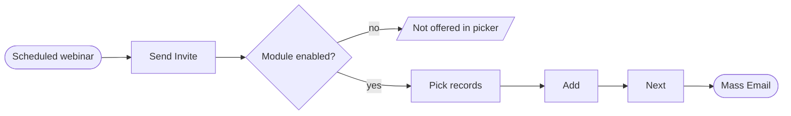

# Flowcharts

Prose and screenshots show the happy path one step at a time. A flowchart shows the
**shape** — every branch, every blocking condition, every terminal state, at once. It is
what a developer builds the control flow from.

**One chart per flow**, wherever a flow is chartable. Give it its own sub-section:

```
### <Flow name> — Options Flow Diagram

To get the complete context of the flow, please refer to the flow diagram.

![[charts/flow-01-send-invite.png|Send Invite, end to end. Add commits the selection; Next opens Mass Email]]
```

That heading and that sentence are house style — the reference PRD uses them verbatim.

---

## The service: mermaid.ink

**Verified working 2026-09-17.** Mermaid source is encoded into a URL and a rendered PNG
comes back. No account, no browser driving, and the source stays diffable so a chart can
be regenerated when the flow changes rather than redrawn.

```bash
B=$(python3 -c "import base64;print(base64.urlsafe_b64encode(open('charts/flow-01.mmd','rb').read()).decode())")
curl -sL -o charts/flow-01.png "https://mermaid.ink/img/$B?type=png&bgColor=FFFFFF&width=1000"
file charts/flow-01.png    # must say: PNG image data
```

**Always check the result is a PNG.** A malformed diagram returns an error body with a
200, and a broken chart in a shipped document is worse than no chart.

The output must be an **image file** — a link alone does not survive the import into Zoho
Writer.

### Sizing — the trap

`flowchart TD` on a linear flow produces something extremely tall. A seven-node chart
came back **1200 × 2805** — unusable on a page.

- **Branching flows:** `TD`, and keep them under ~8 nodes deep.
- **Linear or long flows:** `LR`. Wide beats tall in a document.
- **Aim for roughly 3:2 to 2:1 landscape.** Check the rendered dimensions with `file`
  before embedding; if it is taller than it is wide, redo it as `LR` or split it.
- `width=1000` is a good default. Larger just inflates the file.

### Alternatives, if asked

draw.io and Excalidraw are hand-editable but need a browser driven and a manual export.
Miro has an MCP available but is account-bound and heavier. Prefer mermaid.ink unless the
user wants a chart they can hand-edit afterwards.

---

## Conventions

Chart the decision points, not the decoration.

| Shape | Mermaid | Use for |
|---|---|---|
| Stadium | `A([Entry])` | entry point and terminal states |
| Rectangle | `B[Step]` | a step the user takes |
| Diamond | `C{Condition?}` | a branch — label both edges |
| Parallelogram | `D[/Refused/]` | a blocked or refused outcome |

Rules:

- **Label every branch edge** with its condition (`-- yes -->`, `-- no -->`).
- **Include what blocks progress** — a save that is refused is a terminal state, and it
  is usually the part a developer gets wrong.
- **Use the product's real labels.** If the button says **Add**, the node says Add.
- Leave out cosmetics — hovers, tooltips, animations. They belong in prose.



## Keep the source

Save `charts/<name>.mmd` beside `charts/<name>.png`. When the flow changes, edit the
source and re-render — never redraw. The `.mmd` is also the reviewable artefact: a
reviewer can see a missing branch in eight lines of text far more easily than in a PNG.

---

## The flowchart agent

`.claude/agents/flowchart.md` — a subagent whose only job is turning a flow brief into a
rendered chart. Use it so chart-building does not consume the main context, and so charts
come out consistent across a document.

**Brief it with:** the flow name, the entry point, the ordered steps with their real UI
labels, every branch and its condition, every terminal state including refusals, and the
output path. It returns the saved `.mmd` and `.png` paths plus the rendered dimensions.

The agent renders and verifies; **it does not invent flow logic**. If the brief is
missing a branch, the chart will be missing it too — which makes a chart that looks wrong
a useful signal that the prose missed something. Read the returned chart against your own
notes before embedding it.
