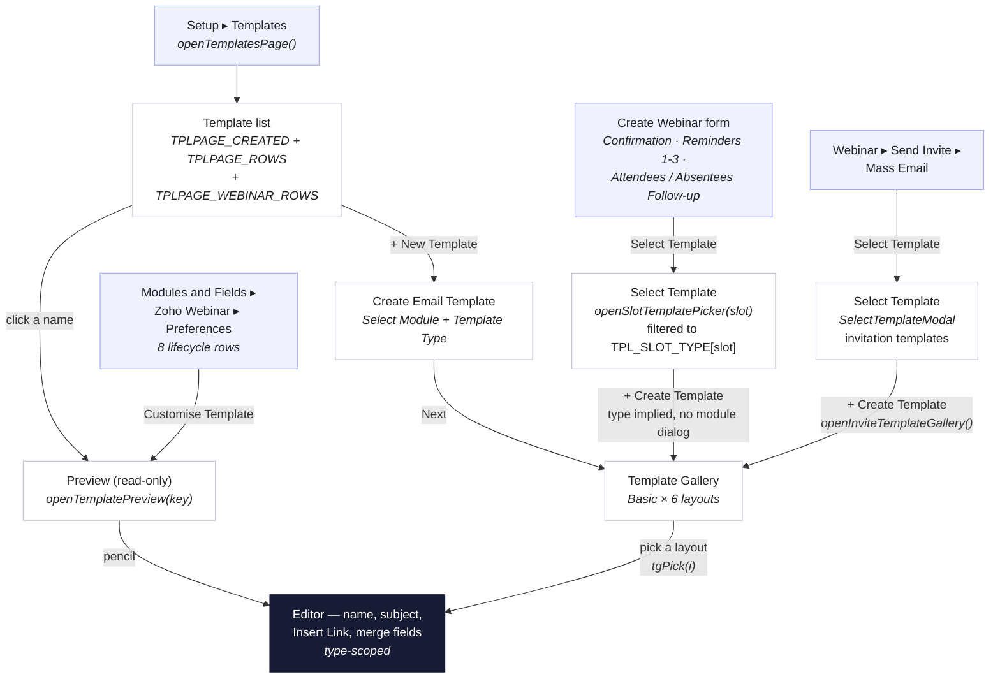
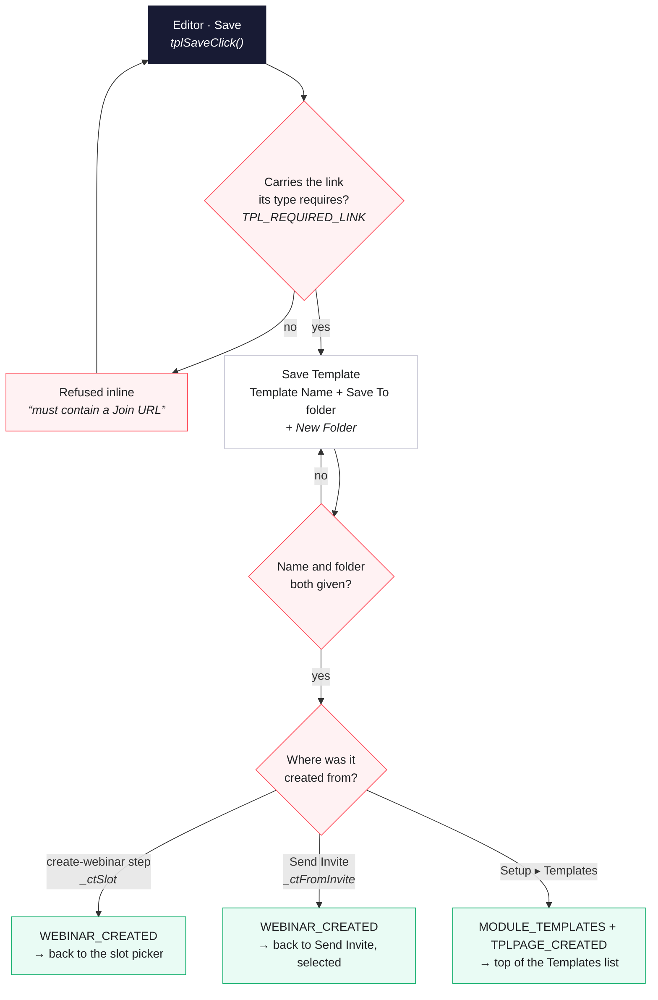

# Template flow — branch `templates-flow`

How an email template is browsed, created, edited and saved in the mock, and how the
four entry points converge on one editor. Derived from `webinar.html`; function names are
given so the chart can be checked against the code.

On this branch templates live in **Setup ▸ Templates**. (On `template-flow-fixes` they
live in the module instead, under Zoho Webinar ▸ Preferences — a different chart.)

## Browse, create, edit

## Saving

## What the type decides

The template type is stamped when the template is created and never asked again. It
governs what the editor offers and what the save refuses.

| Type | May link to | Must contain | Merge categories |
|---|---|---|---|
| Webinar Invitation | Web URL, Email, Registration Link, calendars | Registration Link | Webinar Details, Users, Organization |
| Confirmation Email | Web URL, Join URL, Cancel Registration, calendars | Join URL | **Registrations**, Webinar Details, Users, Organization |
| 1st / 2nd / 3rd Reminder | Web URL, Join URL, Cancel Registration, calendars | Join URL | **Registrations**, Webinar Details, Users, Organization |
| Attendees / Absentees Follow-up | Web URL, Join URL, Recording Link, calendars | Recording Link | **Registrations**, Webinar Details, Users, Organization |
| Webinar Cancelled | Web URL, Email | — | **Registrations**, Webinar Details, Users, Organization |
| None | all of the above | — | as above |

Registrations is absent from the invitation because at invite time nobody has registered
yet (`tplMergeModules()`).
