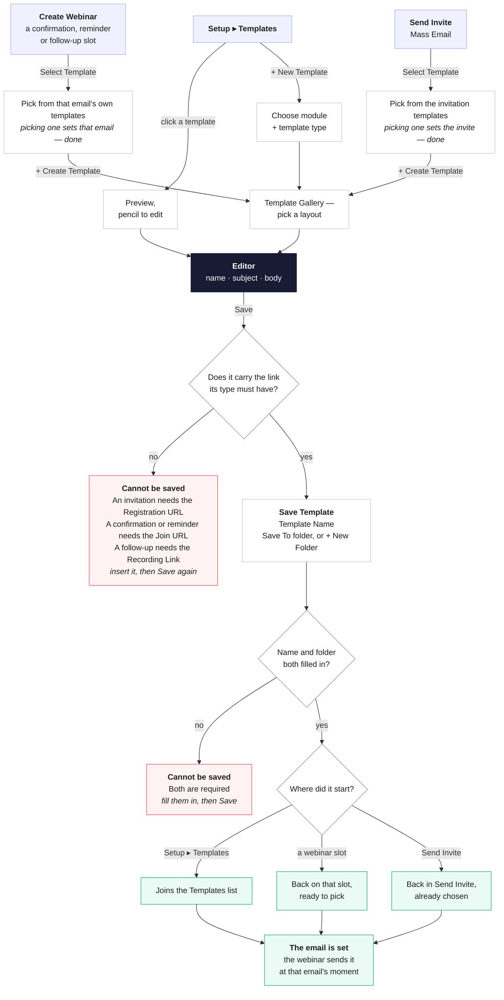

# Template flow — branch `templates-flow`

Three things a user does with templates, and how they meet:

1. **Create Webinar** — set the confirmation, reminder and follow-up emails on a webinar.
2. **Send Invite** — choose the invitation before a mass email goes out.
3. **Setup ▸ Templates** — browse, edit and create templates directly.

From 1 and 2, most of the time you just pick an existing template and you are done.
Creating a new one always goes through the same editor and the same save, wherever you
started.

## The exceptions, in full

**A template cannot be saved unless it carries the one link that makes its email useful.**
That is the only rule that changes by type:

| The template is a… | It cannot be saved without | Because |
|---|---|---|
| Webinar Invitation | **Registration URL** | the invite's whole job is to get someone to sign up |
| Confirmation Email | **Join URL** | the registrant needs a way in |
| 1st / 2nd / 3rd Reminder | **Join URL** | same — the reminder is the join link arriving on time |
| Attendees / Absentees Follow-up | **Recording Link** | after the session, the recording is the payload |
| Webinar Cancelled | nothing | there is nothing left to join, register for or watch |

Two more that apply to every type:

- **A name is required.** Nothing is prefilled — a new template opens with the name and
  subject blank, and saving without a name is refused.
- **A folder is required.** Save To starts on "Select Folder"; saving without one is
  refused. **+ New Folder** makes one on the spot.

And two things the type quietly decides in the editor, before you ever reach Save:

- **Which links you can insert at all.** An invitation is not offered a Join URL; a
  reminder is not offered a Registration Link.
- **Which merge fields you get.** Every email after the invitation can merge the
  registrant's own details; the invitation cannot, because at invite time nobody has
  registered yet.

## Where each step lives in the code

| Step | In `webinar.html` |
|---|---|
| Setup ▸ Templates | `openTemplatesPage()`; rows from `TPLPAGE_CREATED + TPLPAGE_ROWS + TPLPAGE_WEBINAR_ROWS` |
| Create Webinar slot picker | `openSlotTemplatePicker(slot)`, filtered to `TPL_SLOT_TYPE[slot]` |
| Send Invite picker | `SelectTemplateModal` (React) |
| Choose module + type | `openCreateTemplateModal()` → `ctNext()` |
| Type already implied | `slotCreateTemplate()` / `openInviteTemplateGallery()` |
| Template Gallery | `openTemplateGallery()`, `TG_LAYOUTS`, `tgPick(i)` |
| Editor | `openNewWebinarTemplate()` / `openTemplateEditor()`; limits from `TPL_TYPE_LINKS`, `tplMergeModules()` |
| Required-link check | `tplSaveClick()` → `tplMissingRequiredLink()`, rules in `TPL_REQUIRED_LINK` |
| Save dialog + folders | `tplResetFolderPicker()`, `tplFolderList()`, `tplPickFolder()`, `tplCreateFolder()` |
| Name / folder check | `tplSaveConfirm()` → `tplMissingFolder()` |
| Where it lands | `tplSaveConfirm()`: `_ctSlot` → slot picker, `_ctFromInvite` → Send Invite, else `MODULE_TEMPLATES` + `tplPageAddCreatedRow()` |
