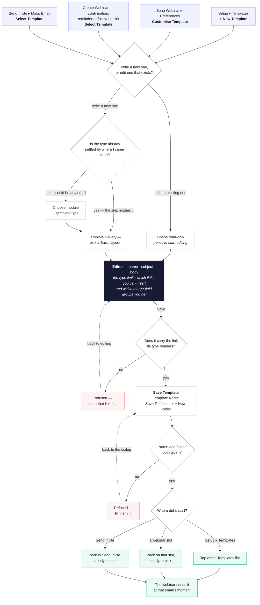

# Template flow — branch `templates-flow`

The whole life of an email template in one chart: where you start, what you decide, where
you write it, what has to be true before it saves, where it lands, and when it gets sent.

On this branch templates live in **Setup ▸ Templates**. (On `template-flow-fixes` they
belong to the module instead, managed under Zoho Webinar ▸ Preferences — a different flow.)

## What the type decides

The type is stamped when the template is created and never asked again. It governs what
the editor offers, and what step 5 refuses.

| Type | May link to | Must contain | Merge-field groups |
|---|---|---|---|
| Webinar Invitation | Web URL, Email, Registration Link, calendars | Registration Link | Webinar Details, Users, Organization |
| Confirmation Email | Web URL, Join URL, Cancel Registration, calendars | Join URL | **Registrations**, Webinar Details, Users, Organization |
| 1st / 2nd / 3rd Reminder | Web URL, Join URL, Cancel Registration, calendars | Join URL | **Registrations**, Webinar Details, Users, Organization |
| Attendees / Absentees Follow-up | Web URL, Join URL, Recording Link, calendars | Recording Link | **Registrations**, Webinar Details, Users, Organization |
| Webinar Cancelled | Web URL, Email | — | **Registrations**, Webinar Details, Users, Organization |
| None | all of the above | — | as above |

Registrations is missing from the invitation because at invite time nobody has registered
yet, so there is no registrant record to merge from (`tplMergeModules()`).

## Where each step lives in the code

| Step | Function / data in `webinar.html` |
|---|---|
| 1 · Setup ▸ Templates | `openTemplatesPage()`, list from `TPLPAGE_CREATED + TPLPAGE_ROWS + TPLPAGE_WEBINAR_ROWS` |
| 1 · Preferences | rows from `WEBINAR_TEMPLATES`, button calls `openTemplatePreview(key)` |
| 1 · webinar slot | `openSlotTemplatePicker(slot)`, filtered to `TPL_SLOT_TYPE[slot]` |
| 1 · Send Invite | `SelectTemplateModal` (React) |
| 2 · module + type | `openCreateTemplateModal()` → `ctNext()` |
| 2 · type implied | `slotCreateTemplate()` / `openInviteTemplateGallery()` |
| 3 · layouts | `openTemplateGallery()`, `TG_LAYOUTS`, `tgPick(i)` |
| 4 · editor | `openNewWebinarTemplate()` / `openTemplateEditor()`; rules from `TPL_TYPE_LINKS`, `tplMergeModules()` |
| 5 · link gate | `tplSaveClick()` → `tplMissingRequiredLink()` |
| 5 · dialog + folder | `tplResetFolderPicker()`, `tplFolderList()`, `tplPickFolder()`, `tplCreateFolder()` |
| 5 · name/folder gate | `tplSaveConfirm()` → `tplMissingFolder()` |
| 6 · routing | `tplSaveConfirm()`: `_ctSlot` → slot picker, `_ctFromInvite` → Send Invite, else `MODULE_TEMPLATES` + `tplPageAddCreatedRow()` |
